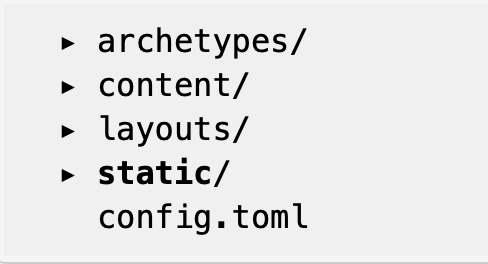

## 背景

要找工作，并且对go比较感兴趣，想从QA转当RD，因此选择了hugo来搭建博客，一来hugo使用起来比较简单，二来即使有什么问题也可以自己看源码解决。

## 步骤

### 1. 安装hugo

mac 使用brew安装

~~~shell
brew install hugo
~~~

### 2. 使用`hugo`命令生成新站点

~~~shell
hugo new site path/to/site
// demo hugo new site ~/hugo
~~~

站点目录结构如下

### 3. 挑选皮肤

我用的是`hyde`皮肤

~~~
cd themes
git clone https://github.com/spf13/hyde.git
~~~

【**注意**】本处的坑在于github pages构建的时候会报错

根据错误提示内容，我们可以注意到github在部署的时候，会把`hyde`皮肤当作一个子模块，因此我们拉取`hyde`代码仓库的时候应该使用一下命令

~~~shell
git submodule add https://github.com/spf13/hyde.git themes/hyde
~~~

这样就可以自动把`hyde`仓库当作一个子模块处理

### 4. 代码上传到github

上传命令就不详细介绍了，详细说一下代码库的配置

以我的github举例，此处使用本人用户名的话，url是`https://maximillion2015.github.io/`,推荐使用这种方案！

如果使用其他名字的话，例如改为`Maximillion2017.github.io`，则url会变成 `https://maximillion2015.github.io/Maximillion2017.github.io/`，就显得比较累赘了。

### 5. 【**大坑**】github page 404

我按照参考文档中hugo官方介绍来操作，遇到了404，于是找了很久才找到原因

> 这时候访问站点,会提示`404`,因为仓库中没有`index.html`文件
>
> 我们把仓库克隆下来,然后把刚才站点的文件全部复制进去,然后提交,这时候访问还是会404,你仔细观察会发现,Hugo构建的静态文件在`public`文件夹,在一个`二级目录`,而GitHub Pages没有选项可以选择二级目录(gitee可以,但是提交代码更新了,需要手动去刷新重新部署),但是会发现,有选择分支的选项,这我们可以利用起来,在git中有个`subtree`,具体使用可以翻阅文档,我们先来实现
>
> ~~~shell
> # 站点根目录执行
> git subtree push --prefix public origin public
> ~~~
>
> 第一个public 是当前项目的文件夹,第二个是远程分支的名称
>
> 这时我们再在仓库的github pages设置里选择分支为public,点击save,稍等片刻,就可以正常访问了

### 6. 示例

我的博客，希望大家共同进步

https://maximillion2015.github.io

## 参考文档

* https://www.gohugo.org

* https://www.xiangxingyu.com/post/building-blog-with-hugo-typora-github-pages/

